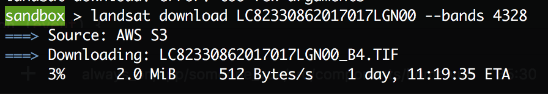
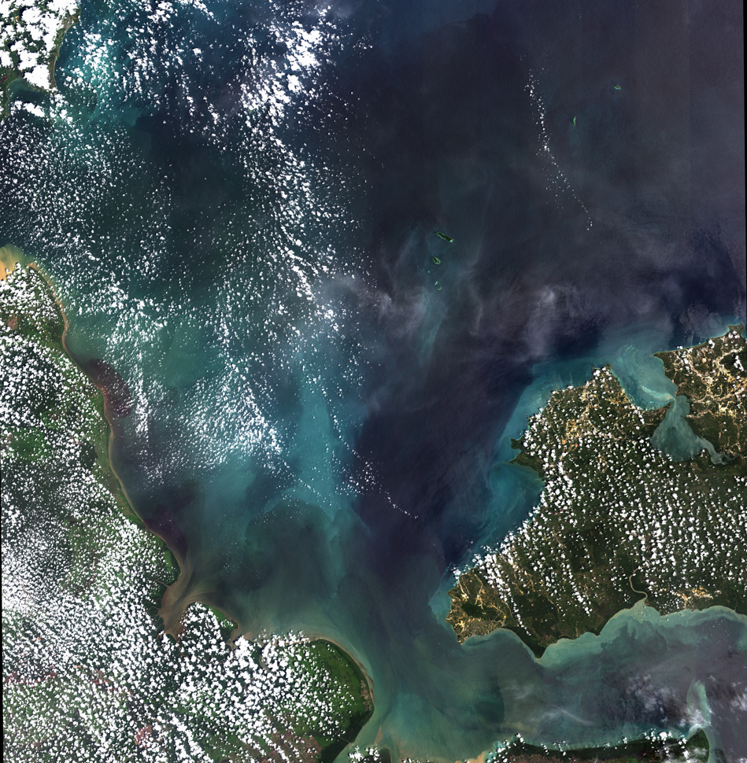
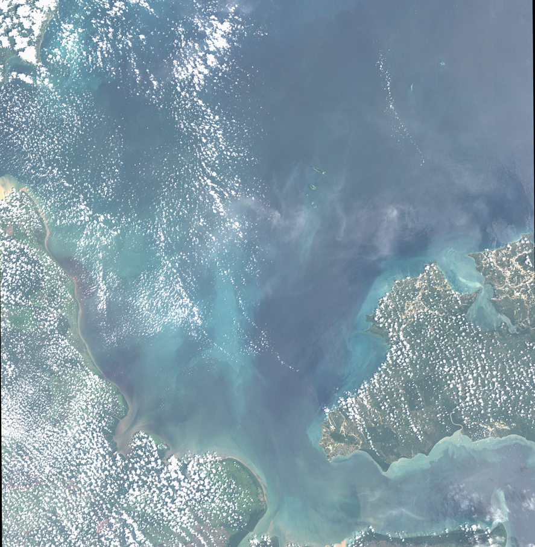
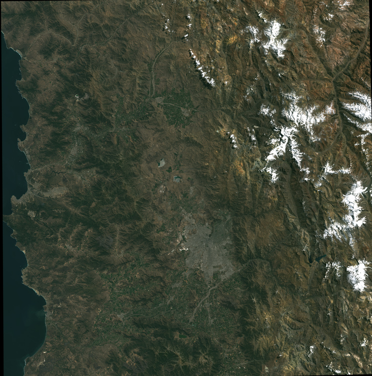
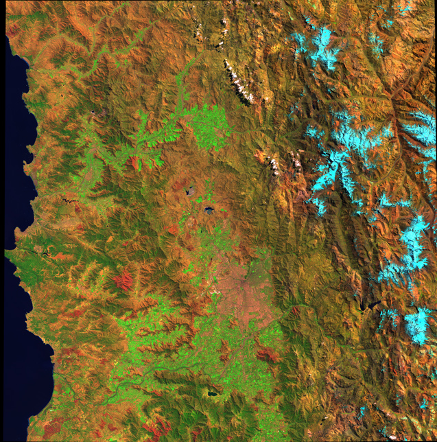

# Assignment 4

First I tried to download images from the [2017 Chilean Wildfires](https://en.wikipedia.org/wiki/2017_Chile_wildfires) using the sceneID ``` LC82330862017017LGN00 ``` and got a ETA of:



So I went on with the Indonesia location:

- 4-3-2:



- With Pansharpening



And then I tried with Santiago, and got better download time:

- 4-3-2:



- 7-5-1:


