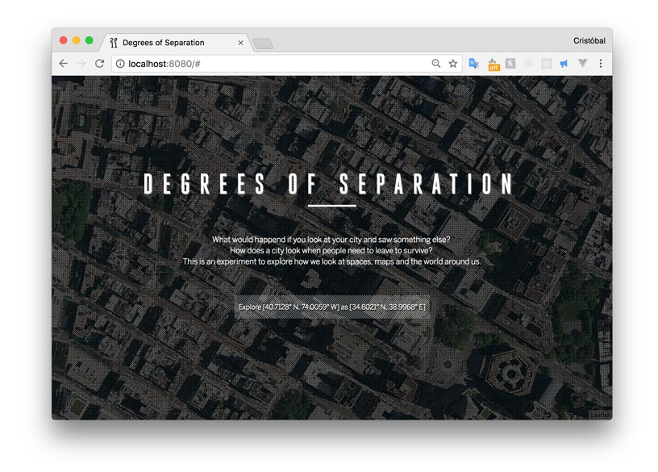

# Degrees of Separation




Why do people flee from a city? How does a city look when people need to leave to survive? This map shows a satellite map of Manhattan and overlays it with satellite images from different cities in Syria destroyed by war.

This project aims to explore how we perceive spatial information and maps based on our previous knowledge of a place. Trying to better understand what does it mean to leave your home and seek refugee in another place.

### Live

[Degrees of Separation](https://cvalenzuela.github.io/Data-and-Digital-Mapping/final/index.html)

### Development

Run Local:
```
webpack-dev-server
```

Build:
```
webpack
```
